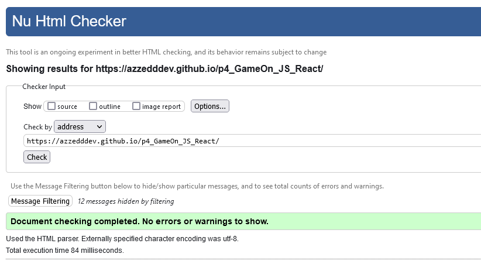

### Project JS REACT - OpenClassrooms
# Créez une landing page avec Javascript

### Tester le projet
Pour tester ce projet, veuillez vous rendre sur le site live pour visualiser : [ p4_GameOn_JS_React](https://azzedddev.github.io/p4_GameOn_JS_React/)

### Technologies
**Autorisés:** HTML / CSS / JS [Vanilla]

## Spécifications techniques

- Langages utilisés : HTML, CSS et Javascript
- Validation au W3C
- Compatible avec Chrome et Firefox
- Desktop first puis s’adapte au format responsive

## Validation au W3C du projet :



Sinon, clonez le projet :
```
git clone https://github.com/AzzeddDev/p4_GameOn_JS_React
```

Et commencer à faire vos changements :)